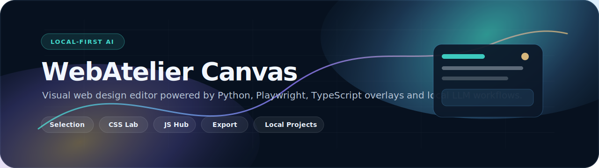

# WebAtelier Canvas

**WebAtelier Canvas** is a local-first visual web design editor for real web pages. It opens a local URL in a headed Chromium browser through Playwright, injects an editable visual layer, and lets you inspect, move, adjust, annotate, save and export design changes without sending the source project to a remote browser service.

The project is focused on **static sites, landing pages and local development URLs**. Manual editing works without an AI model. AI-assisted editing is designed around local Ollama/Gemma workflows and explicit approval before changes are applied.

> Product name: `WebAtelier Canvas`  
> Repository: `selvalabs/webatelier-canvas`  
> Current mode: local-first / service-ready foundation  
> Main platform tested during development: Windows + PowerShell

---

## Development status

WebAtelier Canvas is under active development. Several core workflows are already functional, including launching a local page in Chromium, injecting the visual editor, selecting and adjusting elements, managing project metadata, exporting reviewable packages and running local validation.

Treat the project as a working product foundation rather than a finished production editor. The current version is best suited for local demos, controlled landing-page experiments, technical evaluation and continued development.

---

## What it does

WebAtelier Canvas sits on top of a web page that is already running locally. It does not need to own the original project framework to start editing.

```text
local HTML/CSS/JS, Vite, React, static export, landing page, etc.
        ↓
served on http://127.0.0.1:<port>
        ↓
Playwright opens Chromium headed
        ↓
WebAtelier injects the editor runtime
        ↓
user edits visually and/or approves AI plans
        ↓
patches, metadata, sessions and exports are saved locally
```

This makes it useful for:

- visually reviewing landing pages;
- adjusting static HTML/CSS pages;
- testing layout, spacing, typography and color ideas;
- experimenting with safe UI components from a JS Hub;
- producing reviewable export packages instead of blindly rewriting source files;
- preparing a future service architecture while keeping the current implementation local-first.

---

## Current feature set

### Visual editor

- Headed Chromium launcher through Playwright.
- Runtime JavaScript overlay injected into the target page.
- Element selection, reselection and deselection.
- Global drag behavior for editable elements.
- Resize and rotate foundations.
- Smart guides and alignment grid.
- Selection navigation controls for parent, child and next element.
- Manual text editing with direct interaction mode.

### WebAtelier Canvas panel

- Tabbed panel shell.
- Views for Selection, Design, Layout, CSS, Assets, Timeline, AI and JS Hub.
- Scrollable content views inside the panel.
- Selection-aware empty states.
- Extension registration API for later panels.

### CSS learning inspector

- Canonical CSS property names.
- Normalized sliders.
- Editable values.
- Computed versus inline state.
- Reset-to-cascade behavior.
- Search and explanations for CSS properties.

### Element insertion

- Manual element templates.
- Structured insertion model.
- Relative placement.
- Selection of inserted elements.
- Insertion undo/redo.
- AI-approved insertion flow.
- Timeline replay support.

### JS Hub

- Safe visual tool registry.
- Accordion, Tabs, Modal, Mobile Menu and Reveal tools.
- Preview and approved insertion panel.
- Internal delegated behaviors only.
- Security-focused model tests.

### Project identity and assets

- Project metadata persistence.
- Page title and favicon preview.
- Safe export naming.
- Assets panel.
- Session-scoped metadata storage.

### Export

- Deterministic ZIP package generation.
- HTML export.
- Extracted CSS export.
- Metadata and optional favicon packaging.
- Review report generation.
- Export API, CLI and panel.

### Saved local projects

- Validated project profiles.
- Trusted local root directory.
- Loopback URL association.
- Conservative framework detection.
- Project-scoped sessions and workspaces.
- CRUD API routes.
- Standalone project CLI.
- Service-ready session model.

---

## Architecture

```text
src/webdesign_ai_editor/
  adapters/       filesystem, browser host, Ollama, patch/project repositories
  api/            FastAPI app and local API routers
  domain/         typed models and core contracts
  services/       edit planning, export and project services
  static/         injected editor runtime extensions
  cli.py          main CLI entrypoint
  project_cli.py  saved local project CLI
  export_cli.py   export package CLI

editor-runtime/
  TypeScript/Vite runtime bundle built into src/webdesign_ai_editor/static/

scripts/
  bootstrap, validate, demo and runtime-extension checks

docs/
  local-first design notes, QA, export packages and project documentation
```

The editor is intentionally split into a Python host and browser-side runtime extensions:

- **Python** handles CLI commands, Playwright browser control, FastAPI routes, repositories, persistence and export packaging.
- **JavaScript/TypeScript** handles the injected visual editing layer, UI panels, visual tools and browser interactions.
- **Ollama/Gemma** is optional and used only for AI-assisted edit plans.

---

## Requirements

- Python 3.11 or newer.
- `uv` for Python dependency management.
- Node.js 20 or newer.
- npm.
- Playwright Chromium, installed by the bootstrap script.
- Optional: Ollama with a Gemma model for AI-assisted editing.
- A local page served through a loopback URL such as `http://127.0.0.1:5173` or `http://localhost:3000`.

Manual editing works without Ollama.

---

## Quick start

From the repository root:

```powershell
git clone https://github.com/selvalabs/webatelier-canvas.git
cd webatelier-canvas

.\scripts\bootstrap.ps1
.\scripts\validate.ps1
```

Run the bundled demo:

```powershell
.\scripts\run-demo.ps1
```

The demo script serves `examples/demo`, chooses another port if `4173` is unavailable, opens Chromium through Playwright, injects the editor and shuts down the demo server when the browser closes.

To let the app choose a free port:

```powershell
uv run python -m webdesign_ai_editor demo --port 0
```

---

## Open a real local page

First serve the target page. For a plain HTML/CSS landing page:

```powershell
cd path\to\your-local-site
python -m http.server 5173
```

Then open the editor in another terminal:

```powershell
cd path\to\webatelier-canvas

uv run python -m webdesign_ai_editor doctor
uv run python -m webdesign_ai_editor launch --url http://127.0.0.1:5173
```

For a framework project, start its development server first, then point the launcher to that local URL:

```powershell
uv run python -m webdesign_ai_editor launch --url http://127.0.0.1:3000
```

---

## Save a local project profile

A saved project profile connects a trusted local directory, a loopback URL and project-scoped WebAtelier data.

Create a profile:

```powershell
cd path\to\webatelier-canvas

uv run python -m webdesign_ai_editor.project_cli create `
  --name "Demo Landing Page" `
  --root "path\to\your-local-site" `
  --url "http://127.0.0.1:5173"
```

List profiles:

```powershell
uv run python -m webdesign_ai_editor.project_cli list
```

Inspect a profile:

```powershell
uv run python -m webdesign_ai_editor.project_cli show <project-uuid>
```

Open a saved project:

```powershell
uv run python -m webdesign_ai_editor.project_cli open <project-uuid>
```

The project server must already be running. Opening a saved project creates a project-scoped session and stores WebAtelier data under the application data directory. The source project is not modified directly.

---

## Use Ollama/Gemma

Install or start Ollama separately, then confirm available models:

```powershell
ollama list
```

Set the exact model name in `.env`:

```env
WDA_OLLAMA_MODEL=gemma3:4b
```

Run the doctor command:

```powershell
uv run python -m webdesign_ai_editor doctor
```

AI-assisted editing is expected to follow an approval workflow. The editor should preview an edit plan before applying it. Manual editing remains available when Ollama is off.

---

## Run the local API

Start the local FastAPI service:

```powershell
uv run python -m webdesign_ai_editor serve --host 127.0.0.1 --port 8787
```

The API currently exposes local-first routes for:

- health;
- AI edit planning;
- patch sessions;
- project metadata;
- export packages;
- saved local projects.

The current implementation is not a public multi-user service. See [Security model](#security-model).

---

## Export packages

The export flow produces a reviewable package instead of directly rewriting the original source files.

Expected export contents include:

```text
export.zip
  index.html
  styles.css
  metadata.json
  review-report.md
  assets or favicon when provided
```

Use the export panel inside the editor or the export CLI/API. The goal is to let a human review the generated package before applying it back to a real project.

---

## Validation

Full local validation:

```powershell
cd path\to\webatelier-canvas

uv run ruff check .
uv run pytest
npm ci --prefix editor-runtime
npm run --prefix editor-runtime typecheck
npm run --prefix editor-runtime build
node scripts/check-runtime-extensions.mjs
git diff --exit-code
```

Project validation shortcut:

```powershell
.\scripts\validate.ps1
```

Current known non-blocking build warning:

```text
[INVALID_ANNOTATION] A comment "/*#__PURE__*/" in node_modules/@daybrush/utils/... contains an annotation that Rolldown cannot interpret.
```

The warning comes from a third-party dependency and does not currently block the runtime build.

---

## Manual QA checklist

Before treating a release as usable, test the following on a real local page:

- Open demo through `scripts/run-demo.ps1`.
- Open a standalone HTML/CSS page served by `python -m http.server`.
- Open a saved project profile with `project_cli open`.
- Select an element.
- Deselect with `Escape` and empty canvas click.
- Switch from one selected element to another.
- Drag common elements with the mouse.
- Check alignment guides and grid behavior.
- Use the panel tabs: Selection, Design, Layout, CSS, Assets, Timeline, AI and JS Hub.
- Confirm the right panel scrolls correctly.
- Test help modal, hotkeys and tooltips.
- Adjust CSS values in the learning inspector.
- Insert an element manually.
- Insert a JS Hub tool and verify only delegated internal behavior is used.
- Set project title, favicon and export name.
- Export a ZIP package.
- Reopen or inspect saved project sessions.
- Confirm the original source project was not modified automatically.

---

## Main hotkeys

```text
Escape                 deselect
Ctrl+Z                 undo
Ctrl+Shift+Z / Ctrl+Y  redo
Alt+E                  toggle edit/interact mode
Double-click text      direct text editing
```

---

## Security model

The project is currently **local-first**.

Security gates already present in the design:

- local project URLs must use `localhost` or loopback IP addresses;
- URLs with embedded credentials are rejected;
- root directories must already exist;
- framework detection reads bounded config files and filenames only;
- framework detection does not execute package scripts;
- profiles, sessions and exports live outside the edited source project by default;
- manual edits are persisted as WebAtelier data/export packages, not silently written into source files.

Unsupported without further hardening:

- public network binding;
- multi-user access;
- remote browser workers;
- editing untrusted public websites as a service;
- arbitrary filesystem access;
- background execution of user projects.

Before any remote service mode, add authentication, authorization, per-user filesystem isolation, browser sandboxing, request quotas, audit logging, TLS and explicit network egress controls.

---

## Project structure

```text
.github/workflows/        CI definitions
AGENTS.md                 instructions and constraints for coding agents
README.md                 project overview
editor-runtime/           TypeScript runtime bundle source
examples/demo/            bundled demo page
scripts/                  bootstrap, validate, demo and checks
docs/                     documentation and QA notes
src/webdesign_ai_editor/  Python package and injected static extensions
tests/                    Python tests
```

Important docs:

- `docs/LOCAL_PROJECTS.md` — saved local project profiles and service-ready constraints.
- `docs/EXPORT_PACKAGES.md` — export package behavior.
- `docs/LOCAL_FIRST_AND_WEBSERVICE.md` — local-first and future service notes.
- `docs/QA_PLAN.md` — validation guidance.
- `docs/WINDOWS_SETUP.md` — Windows setup.
- `docs/DEVELOPMENT_GOVERNANCE.md` — contribution workflow.
- `AGENTS.md` — constraints for AI/code assistants.

---

## Current limitations

- The editor does not yet automatically rewrite the original `index.html`, framework templates, JSX or source CSS files.
- Edits are currently represented as patches, local metadata, sessions and export packages.
- AI edits require local Ollama/Gemma availability.
- Complex framework hydration behavior may limit what can be safely edited visually.
- The JS Hub is intentionally limited to reviewed safe visual tools.
- The browser workflow is local/headed and not yet a remote SaaS architecture.

---

## Roadmap

Near-term priorities:

- Full manual QA pass on real landing pages.
- README, QA and release documentation polish.
- Branch protection for `main`.
- Release tag after QA.
- Cleaner import/open flow for plain HTML/CSS folders.
- Better bridge between visual patches and source-code diffs.
- Stronger export review UI.
- More JS Hub tools with explicit safety review.
- Optional source adapter layer for static HTML/CSS projects.

Longer-term directions:

- Framework-aware adapters.
- Human-approved source patch generation.
- Multi-page project navigation.
- Asset management workflow.
- Remote service architecture with proper sandboxing and auth.

---

## Contributing workflow

Preferred flow:

```text
Issue → branch → local implementation → local validation → commit → push → PR → CI → review → squash merge → sync main
```

Before opening or merging a PR:

```powershell
uv run ruff check .
uv run pytest
npm run --prefix editor-runtime typecheck
npm run --prefix editor-runtime build
node scripts/check-runtime-extensions.mjs
```

Keep branches small and avoid stacking PRs unless the dependency is explicit. If a stacked branch becomes hard to merge, recreate a clean branch from `main` and copy only the intended files.

---

## License

MIT. See `LICENSE`.
