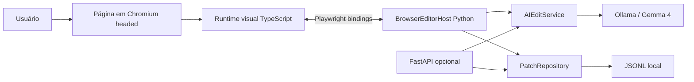
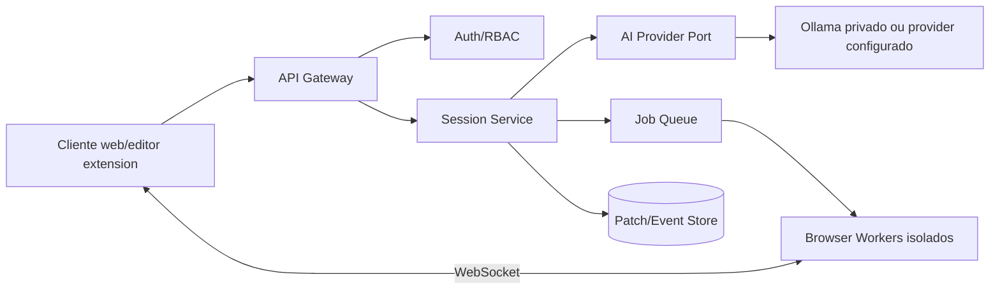

# Arquitetura

## 1. Estilo arquitetural

O projeto usa uma arquitetura local-first orientada a portas e adaptadores.

- **Domínio:** contratos e validações de comandos, ações e patches.
- **Serviços de aplicação:** coordenação de edição por IA e persistência.
- **Adaptadores:** Ollama, Playwright, JSONL e FastAPI.
- **Runtime visual:** TypeScript executado dentro da página alvo.

## 2. Visão geral



## 3. Modo local

1. CLI cria configurações e sessão.
2. `BrowserEditorHost` abre um contexto Chromium isolado.
3. O host expõe bindings no `window`:
   - `__wda_emit`: recebe patches e telemetria local;
   - `__wda_ai_edit`: recebe prompt e contexto e devolve plano validado.
4. O runtime é adicionado como init script e sobrevive a navegações.
5. A edição manual acontece totalmente no browser.
6. A edição por IA atravessa o binding e chama Ollama em `127.0.0.1`.
7. O repositório JSONL registra ações fora do projeto alvo.

Nenhuma porta HTTP é obrigatória nesse fluxo.

## 4. Runtime visual

O runtime contém:

- seletor de elementos;
- gerador de seletor CSS;
- painel isolado em Shadow DOM;
- Moveable para drag, resize, rotate e snapping;
- coleta limitada de contexto visual;
- histórico de patches em memória;
- aplicação de planos de IA;
- bridge abstrata para Python.

O runtime não recebe permissão para executar código retornado pelo modelo. Ele interpreta apenas ações conhecidas.

## 5. Modelo de patch

```json
{
  "id": "uuid",
  "session_id": "uuid",
  "url": "http://127.0.0.1:3000",
  "selector": ".hero__title",
  "source": "manual",
  "action": "set_style",
  "property": "fontSize",
  "before": "40px",
  "after": "48px",
  "created_at": "2026-06-22T12:00:00Z"
}
```

O patch é a linguagem comum entre edição manual, IA, undo/redo e futuros exportadores.

## 6. Smart guides

As guidelines são calculadas a partir de:

- centro horizontal e vertical da viewport;
- bordas e centros de elementos visíveis;
- gaps entre elementos quando suportado pela biblioteca;
- threshold configurável, padrão 6 px.

Para evitar degradação, o runtime limita o número de elementos usados como referência e ignora elementos invisíveis, minúsculos, internos ao editor ou fora da viewport expandida.

## 7. Segurança

### Limites de confiança

- conteúdo da página alvo é não confiável;
- texto enviado ao modelo é tratado como dados, não como instrução;
- saída do modelo é não confiável até passar pelo JSON Schema e pelo Pydantic;
- runtime aceita apenas ações e propriedades allowlisted;
- valores CSS com `url(`, `expression(`, `javascript:` ou markup são rejeitados;
- HTML arbitrário não faz parte do MVP.

### Rede

- Ollama e API usam loopback por padrão;
- host remoto não deve ser permitido sem autenticação e TLS;
- o browser Playwright usa contexto efêmero e separado do perfil pessoal.

## 8. Evolução para webservice



A evolução preserva:

- `EditPlan` e ações;
- `PatchRepository` como porta;
- `AIProvider` como porta;
- runtime visual;
- validações de segurança.

Ela substitui:

- binding Playwright por WebSocket autenticado;
- JSONL por banco transacional/event store;
- browser local por workers isolados;
- sessão implícita por sessão autenticada.

## 9. Decisões que ficam para ADRs futuros

- estratégia de exportação para CSS, Tailwind, React, Vue e Svelte;
- seleção única versus múltipla;
- browser worker local versus containerizado;
- CRDT/OT para colaboração;
- armazenamento de screenshots e visual diffs;
- política de retenção de prompts e patches.
